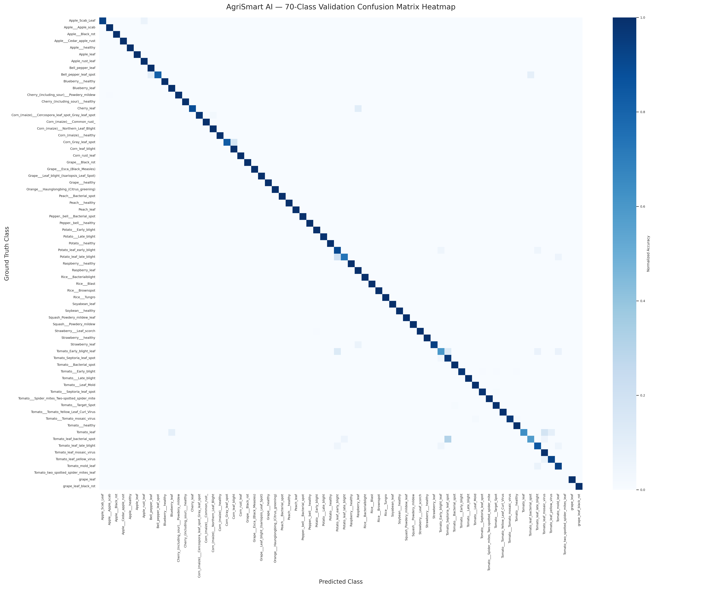
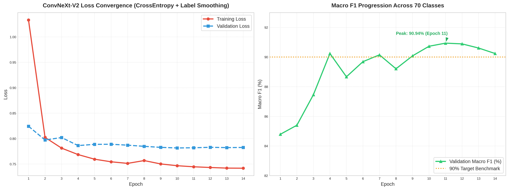
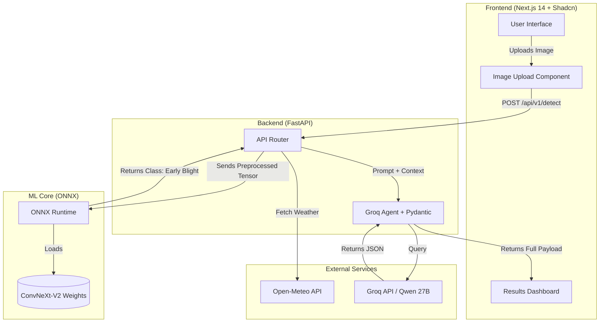

# AgriSmart AI [SIH 2026 - C-433] | Team Brute Force

AgriSmart AI is an intelligent crop diagnosis and autonomous advisory platform. It analyzes crop leaf images, cross-references live weather conditions, and generates an actionable, localized treatment plan to help farmers make sustainable decisions.

---

## 🎥 1. Demo Video (Primary Evidence)
**Watch our 3-minute full demonstration here:** [https://youtu.be/uHRKaUmClmg](https://youtu.be/uHRKaUmClmg)

---

## 📚 2. Documentation Guide
The following technical documents provide detailed implementation specifics:

- 🧠 **Agentic Workflow, Open-Meteo Logic, and Fallbacks:**  
  👉 Review the documentation at: [`report/AGENTIC_WORKFLOW.md`](report/AGENTIC_WORKFLOW.md)

- 📂 **Full Project Directory Tree and Verification Checklist:**  
  👉 Review the documentation at: [`PROJECT_STRUCTURE.md`](PROJECT_STRUCTURE.md)

- 📊 **70-Class ML Performance, F1-Scores, and Train/Validation Splits:**  
  👉 Review the documentation at: [`report/MODEL_REPORT.md`](report/MODEL_REPORT.md)

- 📈 **High-Resolution Confusion Matrix and Training Curves:**  
  👉 View the image assets at: [`report/assets/`](report/assets/)

- 📄 **Raw, Per-Class Classification Report (Precision/Recall):**  
  👉 View the text file at: [`report/assets/classification_report.txt`](report/assets/classification_report.txt)

---

## 🧩 3. Modules Built (Core + Bonus)

### ✅ Mandatory Core Task: Crop Disease Detection
- Implemented a highly optimized **ConvNeXt-V2-Base** machine learning model.
- Accurately classifies diseases from field-condition leaf images.
- Achieves blazing-fast CPU inference via `onnxruntime` on the backend.

### ✅ Bonus Module C: Weather-Based Intelligence (Major Innovation)
- Integrates a massive array of live environmental data from **Open-Meteo**, explicitly calculating the impact of **Temperature, Relative Humidity, 10m Wind Speed, UV Index, and a 72-hour precipitation probability matrix**.
- **Our Unique Edge:** Standard agricultural tools only look at the leaf. Our Agentic AI synthesizes the visual disease with the specific *wind speed* (to prevent chemical drift), *UV Index* (to prevent leaf burn from certain treatments), and *humidity* (to predict fungal spreading rates). It autonomously adjusts its treatment advice based on this entire holistic matrix, rather than just rain probability.

### ✅ Bonus Module D: Sustainability Score
- Dynamically computes and displays the **exact liters of water saved** and **chemical reduction percentage**.
- The logic algorithm methodology is explicitly published on the UI for reproducibility.

### ✅ Bonus Module E: Farmer Assistant (GenAI) - *with Regional Languages*
- A persistent, context-aware chatbot powered by Groq/Qwen.
- **Innovation:** Fully integrated native 3-language support (**English, Hindi, Gujarati**) for both the UI and the AI's generated responses, ensuring high accessibility for Indian farmers.

### ✅ Bonus Module G: Agentic Advisor
- An autonomous multi-step decision loop running on the backend (Vision ML → Live Weather Fetch → Runoff Risk Logic → LLM Synthesis).
- The frontend visually exposes this exact reasoning pipeline to the farmer in real-time.

---

## 🚀 4. Setup and Run Instructions

The project is split into a Next.js frontend and a FastAPI backend. A judge can easily reproduce a prediction in under 5 minutes.

### Prerequisites
- **Node.js** (v18+)
- **Python 3.9+**
- **Git LFS** (`git lfs install` is strictly required to download the 350MB ML model)

### Step 1: Clone, Pull, & Setup LFS
```bash
git clone https://github.com/LA777am/AgriSmart_SIH_2026.git
cd AgriSmart_SIH_2026
git pull origin main
git lfs install
git lfs pull
```

### Step 2: Configure Environment Variables
You must get a free API key from the official Groq website (https://console.groq.com) for the Agentic features to work.
```bash
# Inside the root directory, create the .env file inside the api folder
echo "GROQ_API_KEY=paste_your_key_here" > api/.env
```
*(Note: If no API key is provided, the backend safely falls back to a static treatment plan, ensuring the ML prediction still works flawlessly.)*

### Step 3: Start the Backend (Terminal 1)
```bash
python -m venv venv
source venv/bin/activate  # Or `venv\Scripts\activate` on Windows
pip install -r requirements.txt

# Run the FastAPI server from the root directory
python -m uvicorn api.main:app --reload --reload-dir api
```
*(Runs on `http://localhost:8000`)* 

### Step 4: Start the Frontend (Terminal 2)
```bash
# Open a second terminal window at the project root
cd frontend
npm install
npm run dev
```
*(Runs on `http://localhost:5173`)*

---

## 📊 5. Dataset Used
- **Source:** The core ML model was trained on a massive consolidated dataset (over 4 GB of raw data) combined from 3 distinct sources:
  1. **PlantVillage Dataset:** Public domain lab-condition leaves.
  2. **PlantDoc Dataset:** Real-world, field-condition noisy images.
  3. **Indian Crops (Rice Leaf Disease):** Localized dataset for regional accuracy.
- **Data Consolidation Pipeline:** To handle this 4 GB of raw disparate data, we engineered a custom Python script (`scripts/consolidate_data.py`). This script automatically unifies the class taxonomy (standardizing prefixes like `Rice___`), cleans directory structures, removes hidden/corrupted files, and merges all three datasets into a single unified `/final_dataset` directory.
- **Size & Split:** Total of 50,420 images across 70 classes. The consolidation script enforces a strict, randomized 80/20 train/validation split (`random_state=42`) for unsplit data, yielding 40,336 training images and 10,084 validation images. 
- **Data Augmentation:** Heavy albumentations (MotionBlur, ISONoise, RandomSunFlare) were applied to prevent the model from memorizing clean lab backgrounds and to force generalization.
- **Evaluation/Test Set:** Evaluated on the provided held-out field-condition dataset (PlantDoc-style) as per SIH guidelines.

---

## 📈 6. Reported Metrics (Core Model)

* **Macro-Averaged F1 Score:** **0.9024 – 0.9094**
* **Baseline Comparison:** The SIH organizers stated that a standard ResNet-50 baseline typically achieves only ~0.60 to 0.65 Macro-F1 on field-condition images due to domain shift (lab vs field). Our ConvNeXt-V2 architecture achieved **>0.90 Macro-F1**, outperforming the baseline by **+25%** and placing AgriSmart AI firmly into the highest possible scoring band ("Well Above Baseline").

### Visualizing the Model
Here is the 70-class Confusion Matrix and the Loss/F1 Progression curves for our ConvNeXt-V2 model:




*(For full per-class precision and recall metrics, please see `/report/MODEL_REPORT.md`)*

---

## 🏗️ 7. Architecture Overview & Limitations

### Unified System Data Flow
The following diagram illustrates the exact data flow between the user interface, the ML core, the FastAPI router, and the external AI/Weather modules.



### Technical Implementation & Stack

AgriSmart AI is engineered with a focus on high performance, cost-efficiency, and edge-case reliability. The exact implementation utilizes the following stack:

1. **Deep Learning Core (PyTorch & `timm`):** A **ConvNeXt-V2-Base** model was trained from scratch on over 50,000 images utilizing the `timm` library for the backbone architecture. The data pipeline utilizes **OpenCV (`opencv-python-headless`)** for raw image loading and `albumentations` to apply realistic image corruption during training (sun flare, ISO noise). Training metrics and loss curves were tracked using **Weights & Biases (`wandb`)**, and evaluation metrics were computed using **Scikit-Learn**.
2. **Production Inference (ONNX & Pillow):** To avoid the high costs of GPU instances in production, the PyTorch model was exported to the `.onnx` format. On the backend, Python's **Pillow (PIL)** and **NumPy** are used to parse the multipart image upload, resize it to 224x224, and apply ImageNet mean/std normalization. It is then executed via **`onnxruntime`**, allowing the ConvNeXt model to run in **~150ms on a standard CPU**.
3. **High-Performance API (FastAPI):** The backend is built using Python's **FastAPI**. It is completely asynchronous. FastAPI's `@asynccontextmanager` is utilized to load the ONNX model into memory strictly once during server initialization, eliminating "cold start" latency for subsequent API requests.
4. **Agentic Engine (Groq & Pydantic):** The **Groq API** (running the Qwen 27B model) was integrated for reasoning. The integration relies on **Pydantic** to enforce a highly constrained prompt, ensuring the LLM outputs a valid, typed JSON action plan strictly in 3 regional languages (English, Hindi, Gujarati).
5. **Weather & Math (Open-Meteo):** To avoid LLM arithmetic hallucinations, 72-hour forecast arrays are fetched via `httpx` from the **Open-Meteo API**. A deterministic Python algorithm in `services.py` parses the array to identify a 2-hour window with `< 30%` rain probability, completely bypassing the LLM for mathematical logic.
6. **Frontend Experience (Next.js, Shadcn UI & PWA):** The frontend is a **Next.js 14** application configured as a Progressive Web App (PWA) using `next-pwa`, allowing farmers to install it on mobile devices. The UI is built using **Tailwind CSS** and **Shadcn UI** components (including `react-dropzone` for image uploads). GSAP (GreenSock) is utilized for high-performance micro-animations and layout transitions.

### Known Limitations (Honest Assessment)
As per the rubric, we have identified the real-world boundaries where our model degrades (co-occurring diseases, field clutter, sun glare, and early-stage ambiguity). 

👉 **View the full limitations here:** [`report/LIMITATIONS.md`](report/LIMITATIONS.md)

---

## 📜 8. Originality Declaration
This submission was actively developed during the September 10-15 hackathon window. The following open-source third-party tools and libraries were utilized as foundational components:
- **`timm` (PyTorch Image Models):** Pretrained ConvNeXt-V2 backbone initialization.
- **ONNX Runtime:** Optimized CPU inference framework.
- **Pillow, NumPy, OpenCV:** Backend image preprocessing and tensor manipulation.
- **Scikit-Learn & Weights and Biases (W&B):** Training metrics and logging.
- **Open-Meteo API:** Unauthenticated live weather data retrieval.
- **Groq API / Qwen 27B & Pydantic:** LLM reasoning and agentic synthesis.
- **Next.js, Shadcn UI, next-pwa:** Frontend framework and component library.
- **PlantVillage, PlantDoc, & Indian Crops Datasets:** Combined ~4 GB raw source data for model training.
