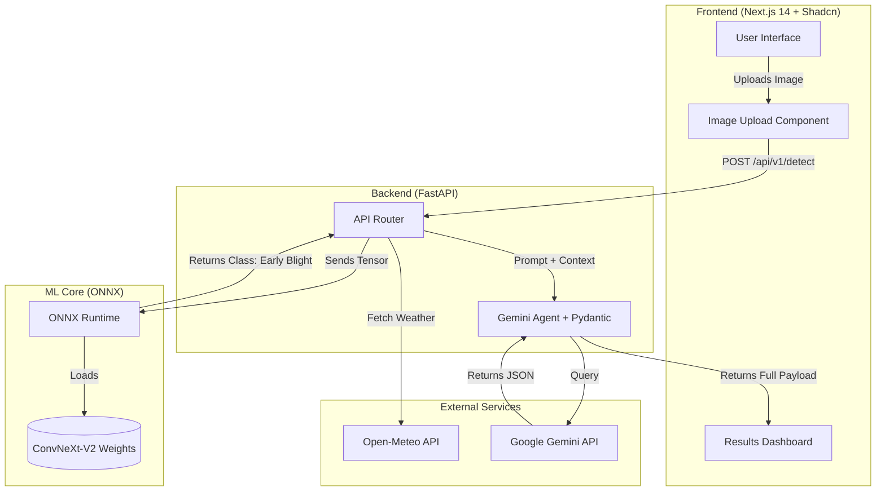

# AgriSmart AI: Complete System Architecture & Mega-Specification

**Purpose:** This is the ultimate, unified blueprint for the entire AgriSmart AI platform. It merges the high-level data flow, the precise API contracts, the User Interface (UI) design, and the low-level code implementation for all three layers (Frontend, Backend, ML Core). 

If a developer or an AI agent has a question about what to build or how it should work, the answer is in this document.

---

## 1. High-Level Component Architecture (The Blueprint)

This diagram maps exactly how the physical components of the application communicate.



---

## 2. The Application UI/UX (What it looks like)

We are building a Single Page Application (SPA). There are only two visual states: **The Upload State** and **The Result State**.

### State 1: The Upload Interface
*   **Aesthetic:** Clean, minimalist, premium (Tailwind standard palette: slate, white, subtle greens).
*   **Header:** Simple "AgriSmart AI" logo text.
*   **Centerpiece:** A massive, dashed-border `react-dropzone` component taking up the center of the screen. Text: *"Drag & Drop a leaf photo here, or click to browse."*
*   **Interaction:** When a user uploads a photo, a thumbnail of the leaf appears in the box.
*   **Location Prompt:** A subtle browser pop-up asks for location access (`navigator.geolocation`). If accepted, a small green checkmark says "Location Secured."
*   **Action:** A massive primary Shadcn `<Button>`: **"Analyze Crop"**.

### State 2: The Result Dashboard
*   **Aesthetic:** Dashboard-style cards appearing below the upload zone.
*   **Card 1 (Top Left) - ML Diagnosis:** A Shadcn `<Card>`. Red tinted if a disease is found, Green if healthy. Displays the Disease Name and a Progress Bar showing Confidence (e.g., 94%).
*   **Card 2 (Top Right) - Weather Context:** A Blue tinted `<Card>`. Displays Current Temp, Humidity, and a 24-hour rain forecast.
*   **Card 3 (Bottom Full Width) - Agentic Action Plan:** A clean checklist. Contains the direct translation from the Gemini output.
*   **Card 4 (Bottom Right) - Green Impact:** A specialized widget showing "Water Saved" and "Chemical Reduction" (Bonus Module D).

---

## 3. The Core Data Flow (Step-by-Step Scenario)

When the farmer clicks "Analyze Crop":

1.  **Frontend (`Next.js`)**: Bundles the image file and the `{lat, lon}` coordinates into a `FormData` object. Sets UI state to `loading=true` (spinner appears). Sends `POST` to backend.
2.  **Backend (`FastAPI`)**: Receives the payload.
3.  **ML Inference (`ONNX`)**: Pre-processes the image (224x224, ImageNet normalization), feeds it to `onnxruntime`, and gets the disease string (`Tomato_Early_Blight`).
4.  **Weather Fetch (`httpx`)**: Asynchronously pings `Open-Meteo` using the `lat/lon`. Gets rain probability and temperature.
5.  **Agentic Execution (`Gemini`)**: Constructs the prompt combining the Disease + Weather. Pings `google-generativeai` with a strict Pydantic JSON schema.
6.  **Return:** FastAPI bundles all three things (ML result, Weather, Gemini JSON) and sends an HTTP 200 response to Next.js.
7.  **Render:** Next.js sets `loading=false`, updates the `result` state, and the UI shifts to the Dashboard cards.

---

## 4. Strict API Contract

Your Frontend developers and Backend developers must agree on this exact contract.

### `POST /api/v1/detect`
**Request Payload (`multipart/form-data`):**
*   `image`: File (JPEG/PNG)
*   `lat`: Float (e.g., 23.02)
*   `lon`: Float (e.g., 72.57)
*   `language`: String (e.g., "hi" for Hindi, "en" for English)

**Response Payload (Strict JSON):**
```json
{
  "success": true,
  "ml_result": {
    "disease_class": "Tomato_Early_Blight",
    "confidence": 0.94,
    "severity": "High"
  },
  "weather_context": {
    "temperature_c": 32.5,
    "humidity": 78,
    "rain_probability": 85
  },
  "agent_advice": {
    "headline": "Immediate Fungicide Application Required",
    "action_steps": [
      "Remove affected leaves immediately.",
      "Apply Mancozeb before tomorrow's heavy rain."
    ],
    "sustainability_impact": {
      "water_saved_liters_per_acre": 12000, 
      "chemical_reduction_percent": 15,
      "methodology_note": "Formula: (12000 * acres) if rain_probability > 80% else 0. Based on delayed irrigation avoiding runoff."
    },
    "translated_message": "कल भारी बारिश होने वाली है। कृपया आज ही फफूंदनाशक का प्रयोग करें।"
  }
}
```

---

## 5. Component Deep Dive 1: ML Core Architecture

*(Assigned to: Members 1 & 2 - Data & Training Engineers)*

### Directory Structure (`/model`)
```text
/model
├── dataset.py        # Data loading and PyTorch Dataset class
├── augmentations.py  # Albumentations pipelines
├── model.py          # ConvNeXt-V2 initialization
├── train.py          # Training loop, Focal Loss, WandB logging
├── export.py         # PyTorch to ONNX conversion
├── predict.py        # Required judge CLI script
└── class_names.json  # AUTO-GENERATED by train.py. DO NOT EDIT MANUALLY.
```

### `class_names.json` — Auto-Generation Rule (Critical)
> **RULE:** This file is NEVER hand-written. It is generated automatically at the end of `train.py` by scanning the actual dataset folder structure. This guarantees 100% alignment between the dataset, the model, and both inference scripts regardless of how many classes the judges provide.

```python
# Generated at end of train.py:
import os, json
class_names = sorted(os.listdir(DATASET_ROOT))  # reads exact folder names from disk
json.dump(class_names, open("model/class_names.json", "w"), indent=2)
```

**Until the real dataset arrives**, a placeholder file is committed:
```json
["PLACEHOLDER_CLASS_0", "PLACEHOLDER_CLASS_1"]
```
*Comment at top of file: `// DO NOT EDIT MANUALLY. Run train.py to regenerate.`*

**Both `predict.py` AND `inference.py` must load from this same file:**
```python
import json
CLASS_NAMES = json.load(open("model/class_names.json"))
```

### 5.1 `dataset.py` (Data Pipeline)

**`class AgriDataset(torch.utils.data.Dataset)`**
*   **Purpose:** Loads images from disk, applies augmentations, and returns tensors.
*   **Constructor (`__init__`)**:
    *   `image_paths: list[str]` - Absolute paths to all images.
    *   `labels: list[int]` - Integer encoded labels.
    *   `transforms: albumentations.Compose` - The augmentation pipeline.

**`def build_dataset(dataset_root: str) -> tuple[list, list]`**
*   **Purpose:** Scans the dataset folder and builds the `image_paths` and `labels` lists that are fed into `AgriDataset`. This is the ONLY place where the disk is scanned — never repeat this logic elsewhere.
*   **Exact Logic:**
```python
import os, json
from sklearn.model_selection import train_test_split

def build_dataset(dataset_root: str):
    class_names = sorted(os.listdir(dataset_root))  # e.g. ["Apple___healthy", ...]
    image_paths, labels = [], []
    for idx, class_name in enumerate(class_names):
        class_dir = os.path.join(dataset_root, class_name)
        for fname in os.listdir(class_dir):
            if fname.lower().endswith((".jpg", ".jpeg", ".png")):
                image_paths.append(os.path.join(class_dir, fname))
                labels.append(idx)
    # Write class_names.json here — single source of truth
    json.dump(class_names, open("model/class_names.json", "w"), indent=2)
    return image_paths, labels, len(class_names)
```
*   `train.py` calls this once: `image_paths, labels, num_classes = build_dataset(DATASET_ROOT)`, then splits into train/val with `train_test_split(image_paths, labels, test_size=0.2, stratify=labels)`.
*   **Function `__getitem__(self, idx) -> tuple[torch.Tensor, int]`**:
    1.  Reads image via `cv2.imread(path)`.
    2.  Converts BGR to RGB via `cv2.cvtColor`.
    3.  Passes image to `self.transforms(image=image)`.
    4.  Returns `(augmented_tensor, label)`.
*   **Function `__len__(self) -> int`**: Returns total number of images.

### 5.2 `augmentations.py` (Robustness Engine)

**`def get_train_transforms() -> albumentations.Compose`**
*   **Purpose:** Simulates real-world field degradation.
*   **Logic:**
    1.  `A.RandomResizedCrop(height=224, width=224, scale=(0.8, 1.0))`
    2.  `A.HorizontalFlip(p=0.5)`
    3.  `A.ColorJitter(brightness=0.2, contrast=0.2, saturation=0.2, p=0.5)`
    4.  `A.MotionBlur(blur_limit=3, p=0.2)` *(Simulates shaky hands)*
    5.  `A.ISONoise(p=0.2)` *(Simulates cheap cameras)*
    6.  `A.RandomSunFlare(flare_roi=(0, 0, 1, 0.5), p=0.1)` *(Simulates field glare)*
    7.  `A.Normalize(mean=[0.485, 0.456, 0.406], std=[0.229, 0.224, 0.225])`
    8.  `ToTensorV2()`
*   **Returns:** A composition of the above transformations.

**`def get_val_transforms() -> albumentations.Compose`**
*   **Purpose:** Prepares images for validation without random distortion.
*   **Logic:** 
    1.  `A.Resize(height=256, width=256)`
    2.  `A.CenterCrop(height=224, width=224)`
    3.  `A.Normalize(mean=[0.485, 0.456, 0.406], std=[0.229, 0.224, 0.225])`
    4.  `ToTensorV2()`

### 5.3 `model.py` (Architecture)

**`def build_model(num_classes: int) -> torch.nn.Module`**
*   **Purpose:** Initializes the ConvNeXt-V2 backbone.
*   **Logic:**
    1.  Loads `timm.create_model('convnextv2_base.fcmae_ft_in22k_in1k', pretrained=True)`.
    2.  Replaces the final classification head: `model.head.fc = nn.Linear(model.head.fc.in_features, num_classes)`.
    3.  Returns the modified model.
*   **Outputs:** A PyTorch model ready for `(B, 3, 224, 224)` inputs.

### 5.4 `train.py` (The Engine)

**`class FocalLoss(torch.nn.Module)`**
*   **Purpose:** Forces the model to learn rare diseases.
*   **Logic:** Implements `Loss = -alpha * (1 - pt)^gamma * log(pt)`.
*   **Parameters:** `alpha=0.25`, `gamma=2.0`.

**`def train_epoch(model, dataloader, optimizer, criterion) -> float`**
*   **Purpose:** Runs one pass of backpropagation over the dataset.
*   **Logic:** 
    1. Sets `model.train()`. 
    2. Loops over batches `(B, 3, 224, 224)`. 
    3. Calculates `loss = criterion(outputs, labels)`. 
    4. `loss.backward()`, `optimizer.step()`.
*   **Returns:** Average epoch loss.

**`def validate_epoch(model, dataloader) -> dict`**
*   **Purpose:** Evaluates the model strictly for the judges' metrics.
*   **Logic:** 
    1. Sets `model.eval()`. `with torch.no_grad():`
    2. Collects all predictions and ground truths.
    3. Uses `sklearn.metrics.f1_score(average='macro')`.
    4. Uses `sklearn.metrics.confusion_matrix()`.
*   **Returns:** `{"macro_f1": float, "accuracy": float}`.

**`def main()`**
*   **Logic:**
    1. Initializes `wandb.init(project="agrismart")`.
    2. Determines num_classes: `num_classes = len(json.load(open("model/class_names.json")))` — never hardcode this value.
    3. Calls `build_model(num_classes=num_classes)`.
    4. Initializes `AdamW` optimizer with `lr=1e-4` and `CosineAnnealingLR`.
    5. **`batch_size=16` — hardcode this. Do not increase. convnextv2_base at 224x224 will OOM on Kaggle P100/T4 above batch_size=32, and 16 gives stable gradients.**
    6. Freezes backbone, runs `train_epoch` and `validate_epoch` for 3 epochs.
    7. Unfreezes backbone, runs for 12 more epochs (Kaggle P100/T4 recommended).
    8. Saves `best_model.pth` based on highest `macro_f1`.
    9. **Auto-generates `class_names.json`** by scanning `DATASET_ROOT` folder names (see Section 5 Directory Structure rule).

### 5.5 `export.py` (Bridging ML to Backend)

**`def export_to_onnx(pytorch_weights_path: str, output_path: str)`**
*   **Purpose:** Converts the heavy PyTorch model into a lightweight, ultra-fast inference binary.
*   **Logic:**
    1.  Loads `num_classes = len(json.load(open("model/class_names.json")))` — never hardcode.
    2.  Loads `model = build_model(num_classes=num_classes)`.
    3.  Loads `best_model.pth` state dict into model.
    4.  **`model.eval()` — MANDATORY before export.** Without this, BatchNorm runs in training mode and the exported weights produce wrong predictions. Silent bug — no crash, just bad outputs.
    5.  Creates a dummy tensor: `dummy_input = torch.randn(1, 3, 224, 224)`.
    6.  Calls `torch.onnx.export(model, dummy_input, output_path, opset_version=17, input_names=['input'], output_names=['output'], dynamic_axes={'input': {0: 'batch_size'}, 'output': {0: 'batch_size'}})`

### 5.6 `predict.py` (The Judges' Interface)

*This script MUST run flawlessly without the rest of the backend.*

**`def preprocess_image(image_path: str) -> np.ndarray`**
*   **Exact Logic (must be byte-for-byte identical with `inference.py` — any divergence = different predictions):**
```python
mean = np.array([0.485, 0.456, 0.406], dtype=np.float32)
std  = np.array([0.229, 0.224, 0.225], dtype=np.float32)
img  = np.array(Image.open(image_path).convert("RGB").resize((224, 224))) / 255.0
img  = (img - mean) / std
img  = img.transpose(2, 0, 1)   # HWC → CHW
img  = np.expand_dims(img, 0)   # (3,224,224) → (1,3,224,224)
img  = img.astype(np.float32)
```

**`if __name__ == "__main__":`**
*   **Logic:**
    1. Uses `argparse` to read `--image`.
    2. Calls `preprocess_image()`.
    3. **Path resolution — use `__file__`-relative paths so the script works regardless of which directory the evaluator runs it from:**
```python
import os
BASE_DIR = os.path.dirname(os.path.abspath(__file__))
CLASS_NAMES = json.load(open(os.path.join(BASE_DIR, "class_names.json")))
session = onnxruntime.InferenceSession(os.path.join(BASE_DIR, "best_model.onnx"))
```
    4. Runs `session.run(["output"], {"input": image_tensor})`.
    5. Gets `argmax` and maps to `CLASS_NAMES[argmax]`.
    6. `print(disease_string)` — zero extra output, nothing else.

---

## 6. Component Deep Dive 2: FastAPI Backend Architecture

*(Assigned to: Backend Engineers)*

### `main.py` (Routing)
*   **Initialization:** `app = FastAPI(lifespan=lifespan)`. The `lifespan` context manager loads the `onnxruntime.InferenceSession` exactly once at startup to prevent 2-second delays on every API call.
*   **CORS — add this immediately after `app` is created (without this, browser blocks all frontend requests on Day 1):**
```python
from fastapi.middleware.cors import CORSMiddleware
app.add_middleware(
    CORSMiddleware,
    allow_origins=["http://localhost:3000"],  # exact origin, not wildcard
    allow_credentials=True,
    allow_methods=["*"],
    allow_headers=["*"],
)
```
*   **Route:** `@app.post("/api/v1/detect")`

### `inference.py` (ONNX Wrapper)
*   **Function:** `def run_onnx_inference(session, image_bytes: bytes) -> dict:`
*   **Exact Preprocessing Logic (MUST be identical to `predict.py` — copy-paste this block):**
```python
import os, json, io
import numpy as np
from PIL import Image

# __file__-relative path — works regardless of which directory caller is in
BASE_DIR   = os.path.dirname(os.path.abspath(__file__))
CLASS_NAMES = json.load(open(os.path.join(BASE_DIR, "..", "model", "class_names.json")))

# Numerically stable softmax — MUST be defined here, do not import from elsewhere
def softmax(x):
    e_x = np.exp(x - np.max(x, axis=-1, keepdims=True))
    return e_x / e_x.sum(axis=-1, keepdims=True)

mean = np.array([0.485, 0.456, 0.406], dtype=np.float32)
std  = np.array([0.229, 0.224, 0.225], dtype=np.float32)
img  = np.array(Image.open(io.BytesIO(image_bytes)).convert("RGB").resize((224, 224))) / 255.0
img  = (img - mean) / std
img  = img.transpose(2, 0, 1)   # HWC → CHW
img  = np.expand_dims(img, 0)   # → (1, 3, 224, 224)
img  = img.astype(np.float32)
outputs    = session.run(["output"], {"input": img})[0]
confidence = float(softmax(outputs)[0].max())
class_idx  = int(outputs[0].argmax())
disease    = CLASS_NAMES[class_idx]
severity   = "High" if confidence > 0.85 else "Medium" if confidence > 0.60 else "Low"
```
*   **Returns:** `{"disease_class": disease, "confidence": confidence, "severity": severity}`

### `services.py` (External Calls)
*   **Function 1:** `async def fetch_weather(lat: float, lon: float) -> dict:`
    *   **Exact URL:**
        ```
        https://api.open-meteo.com/v1/forecast
        ?latitude={lat}&longitude={lon}
        &current=temperature_2m,relative_humidity_2m
        &hourly=precipitation_probability
        &forecast_days=1
        ```
    *   **Extract fields:** `current.temperature_2m`, `current.relative_humidity_2m`, `hourly.precipitation_probability[0]`.
    *   **Returns:** `{"temperature_c": float, "humidity": int, "rain_probability": int}`

*   **Function 2:** `async def generate_agent_advice(disease_data, weather_data, language) -> dict:`
    *   **Exact System Prompt (hardcoded, do not paraphrase):**
        ```
        You are an expert agronomist AI. Given a crop disease and weather data,
        respond ONLY with a valid JSON object matching this exact schema — no extra text:
        {
          "headline": "string (max 10 words)",
          "action_steps": ["string", "string"],
          "sustainability_impact": {
            "water_saved_liters_per_acre": number,
            "chemical_reduction_percent": number,
            "methodology_note": "string"
          },
          "translated_message": "string (in {language} language)"
        }
        ```
    *   **Exact User Prompt (built dynamically):**
        ```
        Disease: {disease_class}. Confidence: {confidence}.
        Weather: {temperature_c}°C, Rain probability: {rain_probability}%.
        Language for translated_message: {language}
        ```
    *   **Environment:** Load API key via `os.getenv("GEMINI_API_KEY")`. See Section 8.
    *   Uses `google.generativeai`. Passes a strict `pydantic.BaseModel` to the `response_schema` parameter to enforce the JSON structure defined in Section 4.
    *   **Gemini Fallback (MANDATORY — prevents full request failure on rate-limit):**
        Wrap the Gemini call in `try/except`. On any exception, do NOT raise a 500. Instead return:
        ```python
        {"headline": "AI Advisor temporarily unavailable.",
         "action_steps": ["ML diagnosis is complete and accurate.", "Agronomist advice will be available shortly."],
         "sustainability_impact": None,
         "translated_message": None,
         "agent_status": "unavailable"}
        ```
        The frontend renders this as a soft warning, NOT an error. The ML result and weather data still display fully.

---

## 7. Component Deep Dive 3: Next.js Frontend Architecture

*(Assigned to: Frontend Engineers)*

### `next.config.mjs` (PWA Setup)
*   **Purpose:** Configures the application as a Progressive Web App (PWA) using `next-pwa`, allowing farmers to install the app on their home screens.

### UI Framework
*   **TailwindCSS** + **Shadcn UI**. Must strictly install and use the following Shadcn components: `Button`, `Card`, `Alert` (for error states), and `Progress` (for the ML confidence bar).

### `app/page.jsx` (Main View)
*   **State Hooks:**
    *   `const [file, setFile] = useState(null);`
    *   `const [location, setLocation] = useState(null);`
    *   `const [language, setLanguage] = useState("en");` *(Prototype: English only. Translation layer wired up but not deeply implemented yet.)*
    *   `const [loading, setLoading] = useState(false);`
    *   `const [error, setError] = useState(null);`
    *   `const [result, setResult] = useState(null);`

*   **Exact `handleAnalyze` Function (do not invent fetch logic):**
```javascript
const handleAnalyze = async () => {
  setLoading(true);
  setError(null);
  const formData = new FormData();
  formData.append("image", file);
  formData.append("lat", location?.lat ?? 20.5937);  // fallback = center of India
  formData.append("lon", location?.lon ?? 78.9629);
  formData.append("language", language);
  try {
    const res = await fetch("http://localhost:8000/api/v1/detect", {
      method: "POST",
      body: formData,
    });
    if (!res.ok) throw new Error(`Server error: ${res.status}`);
    const data = await res.json();
    setResult(data);
  } catch (err) {
    setError(err.message);
  } finally {
    setLoading(false);
  }
};
```
*   **Error State:** If `error !== null`, render a Shadcn `<Alert variant="destructive">` above the Dropzone. Do not leave the user on a spinner.
*   **Location Fallback:** Default `lat: 20.5937, lon: 78.9629` is the geographic center of India. Used when user denies location access.

### `components/Dropzone.jsx`
*   Uses `react-dropzone`. Validates file type (`image/jpeg`, `image/png`). Sets `file` state in parent.

### `components/Dashboard.jsx`
*   Conditionally rendered `if (result !== null)`.
*   Maps `result.ml_result.disease_class` into a visual string (replaces underscores and triple-underscores with spaces).
*   Renders Shadcn `<Progress value={result.ml_result.confidence * 100} />` for the confidence bar.
*   Maps `result.agent_advice.sustainability_impact` into the Green Impact Card.

---

## 8. Environment Variables & Security

*   **File:** `/api/.env` — **NEVER commit this file. Add to `.gitignore` explicitly.**

```
# /api/.env
GEMINI_API_KEY=your_key_here
```

*   **Loading pattern in `services.py` (use exactly this):**
```python
import os
from dotenv import load_dotenv
import google.generativeai as genai

load_dotenv()  # reads /api/.env
genai.configure(api_key=os.getenv("GEMINI_API_KEY"))
```

*   **`.gitignore` must explicitly contain:**
```
/api/.env
*.pth
best_model.onnx
```

---

## 9. Full `requirements.txt`

*   **Location:** `/requirements.txt` at the project root. Covers all three layers.

```
# ML Core (train on Kaggle/Colab, not locally)
torch>=2.0.0
timm>=0.9.0
albumentations>=1.3.0
onnx>=1.14.0
onnxruntime>=1.16.0
scikit-learn>=1.3.0
wandb>=0.15.0
opencv-python-headless>=4.8.0
Pillow>=10.0.0
numpy>=1.24.0

# Backend
fastapi>=0.104.0
uvicorn>=0.24.0
python-multipart>=0.0.6
httpx>=0.25.0
pydantic>=2.0.0
google-generativeai>=0.3.0
python-dotenv>=1.0.0
```
